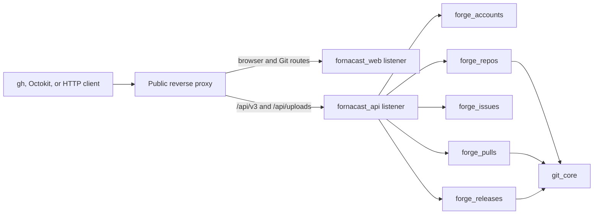

# GitHub-Compatible REST API Design

Date: 2026-07-21
Status: Approved

## Planning Lineage

This specification establishes a first-class, GitHub-compatible REST API
product slice for Fornacast. It supersedes the REST-API exclusion in the root
README and expands the delivery scope described by the repository-foundation
design to include collaboration and releases through the API.

The smart-HTTP behavior in
`docs/superpowers/specs/2026-07-17-git-authentication-design.md` remains in
force. This specification extends personal API keys with GitHub classic PAT
scopes and token-only REST authentication; it does not replace Git Basic
authentication or the existing Git transport permissions.

The current Git HTTP controller still accepts an account password as a
fallback, contrary to that approved authentication design. Removing the
fallback, updating its regression test, and proving that only PATs authenticate
private Git HTTP are explicit migration work for the first API delivery slice.

This is a compatibility subset, not an undertaking to implement every GitHub
REST resource. Within the explicitly listed endpoints, Fornacast matches the
GitHub Enterprise Server REST contract unless this document records a deliberate
exception.

## Goal

An ordinary authenticated Fornacast user can use GitHub-oriented clients
against `https://<fornacast-host>/api/v3` to complete this release-defining
workflow:

1. Create an organization and a repository.
2. Create a branch and commit content to it.
3. Create, edit, comment on, and close or reopen an issue.
4. Open and merge a pull request.
5. Publish a release and upload a release asset.

The resulting repository must remain a real Git repository: a normal client
can clone or fetch it and observe the content commit, merge commit, refs, and
release tag created through the API.

## Compatibility Boundary

### Included resource families

- authenticated users;
- organizations;
- repositories;
- branches and Git refs;
- commits;
- repository contents;
- issues and issue comments;
- pull requests and merges; and
- releases and release assets.

### Contract

The normative upstream baseline is GitHub Enterprise Server 3.21 at commit
[`03ca9c1cac754ec9b8369dc75de8a8c753c6e087`](https://github.com/github/rest-api-description/tree/03ca9c1cac754ec9b8369dc75de8a8c753c6e087/descriptions/ghes-3.21)
of GitHub's official REST API description. The bundled
`ghes-3.21.2022-11-28.json` and `ghes-3.21.2026-03-10.json` files at that commit
are immutable sources for the two selected versions. This document's endpoint
manifest and deliberate divergences form a narrow overlay and take precedence
where they intentionally reduce or change that contract. Moving to another
GHES or OpenAPI revision requires a new reviewed design change.

For every endpoint listed in this specification, the external method, path,
request field names, successful status, common failure statuses, pagination,
and stable response fields follow the matching GitHub REST endpoint. JSON
objects include the conventional GitHub identifiers, timestamps, state fields,
actor objects, and URL fields needed by `gh api` and Octokit. Unsupported
optional fields that are required by a GitHub response schema are represented
by their compatible `null`, `false`, or empty value rather than by invented
behavior.

All numeric IDs are stable Fornacast database IDs. Node IDs, where a compatible
schema requires them, are stable opaque values and are not a GraphQL contract.
All timestamps are UTC ISO-8601 values. API, HTML, clone, upload, and download
URLs are built from configured canonical public origins, never from an
untrusted request `Host` header or the internal listener address.

### Deliberate divergences

- Any ordinary authenticated user may create an organization, matching the
  current Fornacast web application. GitHub Enterprise Server restricts the
  compatible endpoint to site administrators; Fornacast therefore applies its
  `write:org` scope and self-as-admin rule instead of GitHub's site-admin
  authorization rule.
- Organization profile updates also use `write:org` rather than GitHub's
  broader `admin:org`/administrative authorization.
- Personal API keys keep the recognizable `fc_pat_` prefix rather than a
  GitHub-owned prefix.
- The Git refs write endpoints accept branch refs only; release tag creation is
  owned by the release API. Ref updates are fast-forward only and `force: true`
  is rejected.
- Pull requests are limited to branches in the same repository and support
  only a genuine two-parent merge commit.
- Release source-archive fields are present with `null` values because source
  archive generation is outside this release.
- Until repository-scoped browser pages exist, `html_url` for new issue, pull,
  and release resources uses the corresponding public API URL instead of a
  dead HTML route.
- Commit and pull endpoints return their JSON representations only;
  `application/vnd.github.diff` and `application/vnd.github.patch` return
  `406` in this release.

Compatibility does not include GitHub trademarks, GitHub-specific global IDs,
or behavior for endpoints not listed here.

## Non-Goals

- GraphQL, webhooks, GitHub Apps, OAuth Apps, deploy keys, or fine-grained PATs.
- Repository deletion, transfer, forks, mirrors, templates, or branch
  protection.
- Raw Git blob, tree, commit, or tag object creation endpoints.
- Cross-repository pull requests, review requests, reviews, review comments,
  squash merges, or rebase merges.
- Milestones, projects, reactions, discussions, notifications, or issue events.
- Generated release notes, release discussions, immutable releases,
  attestations, package publishing, or source-archive generation.
- A replacement for the existing browser UI or Git smart-HTTP/SSH transports.
- Compatibility with unlisted GitHub REST endpoints merely because they share
  the `/api/v3` prefix.
- Conditional-request caching and optional `304` responses in the first
  release.

## Application Architecture

### Separate API application and listener

Add a new umbrella application at `apps/fornacast_api`. It owns:

- `FornacastAPI.Endpoint`, with its own Bandit listener on a configurable
  internal port;
- `FornacastAPI.Router`, whose REST routes are rooted at `/api/v3` and whose
  release-asset upload routes are rooted at `/api/uploads`;
- stateless JSON request parsing and response rendering;
- request IDs, telemetry, PAT authentication, API-version selection, rate
  limiting, pagination, and GitHub-compatible error handling; and
- an internal `/health` route outside the versioned public surface.

The API endpoint has no browser session, CSRF plug, HTML rendering, assets, or
dependency on `fornacast_web`. The reverse proxy maps the public host's
`/api/v3` and `/api/uploads` paths to this listener without stripping either
prefix. The internal listener remains directly usable for local integration
tests. The health route need not be exposed by the public reverse proxy.

That same-origin mapping is a required deployment component, not an optional
operator optimization. The endpoint slice owns the supported deployment
configuration or example, forwarded-header trust configuration, and a smoke
test that proves both canonical public prefixes reach the API listener. A
release must not claim `https://<fornacast-host>/api/v3` support while exposing
only the web listener or omitting `/api/uploads`.

The release starts both `fornacast_web` and `fornacast_api`, together with all
domain applications. The root `mix fornacast.run` development entrypoint starts
the complete web and API stack. Development and test configuration may use
port `4001` as the API default, while production supplies an explicit internal
port and bind address.



### Domain ownership

API controllers are thin protocol adapters. They parse the compatible request,
call one domain operation, and render its tagged result. They do not contain
authorization rules, Ecto queries, Git algorithms, file writes, or recovery
logic. Version-aware serializers prevent Ecto schemas and internal structs from
becoming the wire contract.

Existing application ownership remains:

- `forge_accounts`: users, organizations, memberships, personal API keys, and
  token authentication;
- `forge_repos`: repository lifecycle, collaborators, visibility, and
  repository authorization; and
- `git_core`: bounded Git reads plus the new blob, tree, commit, ref, merge,
  and tag write primitives.

Add three domain applications:

- `forge_issues`: repository issue numbers, issues, comments, labels, and
  assignees;
- `forge_pulls`: pull-request state, Git snapshots, merge operations, and the
  pull request's issue identity; and
- `forge_releases`: releases, tags, asset metadata, asset storage, and recovery
  operations.

Dependencies remain one-way: `forge_issues` depends on `forge_accounts` and
`forge_repos`; `forge_pulls` depends on `forge_issues`, `forge_repos`, and
`git_core`; and `forge_releases` depends on `forge_accounts`, `forge_repos`, and
`git_core`. `forge_repos` never calls any of the new domains. Domain
applications never depend on either HTTP application. Schemas continue to use
`Fornacast.Repo`, with migrations in the existing central migration path.

To keep pull-request creation atomic without reversing that dependency,
`forge_issues` exposes a composable `Ecto.Multi` operation that allocates the
repository number and inserts the issue identity without starting its own
transaction. `forge_pulls` composes that operation with its pull-request insert
and executes one outer transaction. No API controller coordinates nested
transactions.

## HTTP and Version Contract

### API versions and media types

The first release supports the GitHub API versions `2022-11-28` and
`2026-03-10` through `X-GitHub-Api-Version`.

- A missing version header selects `2022-11-28`.
- `GET /api/v3/versions` returns `200` with
  `["2022-11-28", "2026-03-10"]`.
- An unsupported version returns a GitHub-shaped client error.
- Both versions share domain operations, but they have separate request
  validators and response serializers from the first release. The pinned
  schemas already differ: the 2026 version removes the deprecated top-level
  rate-limit `rate` property, changes content submodule typing, and removes
  fields from repository, issue, and pull-request responses. Golden fixtures
  and contract tests cover both schemas rather than serializing one shape for
  both headers.
- Ordinary JSON endpoints accept an absent `Accept`,
  `application/vnd.github+json`, or `application/json`. JSON request bodies use
  `application/vnd.github+json` or `application/json`.
- Contents responses additionally negotiate
  `application/vnd.github.raw+json`, `application/vnd.github.html+json`, and
  `application/vnd.github.object+json` as defined by the pinned operation.
- Release asset downloads accept `application/octet-stream`; release asset
  uploads bypass the JSON parser and accept the asset's declared content type.
- Commit and pull `diff`/`patch` media types are explicitly unsupported and
  return `406`; GitCore may still compute bounded internal diffs for JSON
  metadata and mergeability.
- Every request under `/api/v3` or `/api/uploads` must include a non-empty
  `User-Agent`.

An unsupported API version or malformed JSON returns `400`, a missing
`User-Agent` returns `403`, an unacceptable response media type returns `406`,
and an unsupported request content type returns `415`, each with the common
error body. `/health` is an internal operational route and is exempt from API
versioning, User-Agent, PAT authentication, rate limiting, content negotiation,
and GitHub headers.

Successful and error responses expose the applicable GitHub-style headers:

- `X-GitHub-Api-Version-Selected`;
- `X-GitHub-Media-Type`;
- `X-GitHub-Request-Id`;
- `X-OAuth-Scopes` and `X-Accepted-OAuth-Scopes`; and
- `X-RateLimit-Limit`, `X-RateLimit-Remaining`, `X-RateLimit-Reset`,
  `X-RateLimit-Used`, and `X-RateLimit-Resource`.

### Pagination

Collection endpoints accept `page` and `per_page`. `page` defaults to `1`,
`per_page` defaults to `30`, and `per_page` is capped at `100`. Responses emit
RFC 8288 `Link` headers for applicable `next`, `prev`, `first`, and `last`
relations. Ordering is deterministic, with a stable ID tiebreaker, so rows do
not silently repeat or disappear within one unchanged dataset.

### Normative operation manifest

Only the method/path pairs listed in the resource sections, plus
`GET /api/v3/versions`, `GET /api/v3/rate_limit`, and the release upload route,
are implemented. For their successful JSON responses, the selected pinned
OpenAPI response schema is normative. Fields for explicitly unsupported
features use the `null`, `false`, or empty value defined earlier. The first
delivery slice checks in a pruned OpenAPI 3.0 artifact containing these
operations, both version schemas, the `/api/uploads` server override, and this
overlay; subsequent slices extend that same contract artifact before adding
controllers.

Read operations return `200`, except the merged-state check returns `204` when
merged and `404` otherwise. Create operations return `201`. PATCH operations
return `200`. Contents PUT returns `201` for create and `200` for update;
contents DELETE returns `200`. Pull merge returns `200`. Comment, release, and
asset DELETE return `204`. Conditional `304` behavior is not implemented.

The accepted mutation fields are complete:

Paths in the following two tables are relative to `/api/v3` unless they begin
with `/api/uploads`.

| Operation | Accepted fields |
| --- | --- |
| `POST /admin/organizations` | required `login`, required `admin`, optional `profile_name` |
| `PATCH /orgs/:org` | `name`, `description` |
| `POST /user/repos`, `POST /orgs/:org/repos` | required `name`; `description`, `private`, `visibility`, `default_branch`, `has_issues`, `auto_init`, `allow_merge_commit`; `has_projects`, `has_wiki`, `has_discussions`, `allow_squash_merge`, and `allow_rebase_merge` are accepted only as `false` |
| `PATCH /repos/:owner/:repo` | `name`, `description`, `private`, `visibility`, `default_branch`, `has_issues`, `allow_merge_commit`; `has_projects`, `has_wiki`, `has_discussions`, `allow_squash_merge`, and `allow_rebase_merge` are accepted only as `false` |
| `POST /repos/:owner/:repo/git/refs` | required `ref`, required `sha` |
| `PATCH /repos/:owner/:repo/git/refs/:ref` | required `sha`; `force` is accepted only as `false` or omitted |
| `PUT /repos/:owner/:repo/contents/*path` | required `message`, required `content`; `sha` required for update; `branch`, `committer`, `author` |
| `DELETE /repos/:owner/:repo/contents/*path` | required `message`, required `sha`; `branch`, `committer`, `author` |
| `POST /repos/:owner/:repo/issues` | required `title`; `body`, `assignee`, `assignees`, `labels` |
| `PATCH /repos/:owner/:repo/issues/:number` | `title`, `body`, `state`, `state_reason`, `assignee`, `assignees`, `labels` |
| `POST /repos/:owner/:repo/issues/:number/comments` | required `body` |
| `PATCH /repos/:owner/:repo/issues/comments/:id` | required `body` |
| `POST /repos/:owner/:repo/pulls` | required `title`, required `head`, required `base`; `body` |
| `PATCH /repos/:owner/:repo/pulls/:number` | `title`, `body`, `state`, `base` |
| `PUT /repos/:owner/:repo/pulls/:number/merge` | `commit_title`, `commit_message`, `sha`, `merge_method` (only `merge`) |
| `POST /repos/:owner/:repo/releases` | required `tag_name`; `target_commitish`, `name`, `body`, `draft`, `prerelease` |
| `PATCH /repos/:owner/:repo/releases/:id` | `name`, `body`, `draft`, `prerelease` |
| `POST /api/uploads/repos/:owner/:repo/releases/:id/assets` | raw body; required `name` query field, optional `label` query field |
| `PATCH /repos/:owner/:repo/releases/assets/:asset_id` | `name`, `label` |

An unrecognized JSON field, or a pinned field that this manifest explicitly
does not accept, returns `422`; it is never silently treated as supported.
Unsupported query fields are ignored and cannot alter the result. The supported
collection/read query subset is:

| Resource | Additional query fields beyond `page`, `per_page` |
| --- | --- |
| Authenticated repository list | `visibility`, `affiliation`, `type`, `sort`, `direction`, `since`, `before` |
| User or organization repository list | `type`, `sort`, `direction` |
| Branch list | `protected` |
| Commit list | `sha`, `path`, `author`, `since`, `until` |
| Commit detail | none |
| Contents GET | `ref` |
| Issue list | `state`, `labels`, `assignee`, `creator`, `sort`, `direction`, `since` |
| Issue comments | `since` |
| Pull list | `state`, `head`, `base`, `sort`, `direction` |
| Release and asset lists | none |

Single-resource reads, `/user`, `/user/orgs`, `/versions`, and `/rate_limit`
accept only their path/header contract and pagination where the pinned operation
defines a collection. This manifest deliberately rejects `make_latest`,
generated release notes, release discussions, release-asset `state`, pull
drafts, cross-repository head selectors, milestones, issue types, and all
fields belonging to the non-goals.

### Errors

Errors use the GitHub JSON shape:

```json
{
  "message": "Validation Failed",
  "documentation_url": "https://docs.github.com/en/enterprise-server@3.21/rest/issues/issues",
  "errors": []
}
```

The URL above is an illustrative complete value, not an ellipsis placeholder.
Each operation, including a local policy divergence, uses the full URL of its
closest GHES 3.21 operation page; the response `message` and stable
`errors[].code`, when a validation array applies, identify the narrower
Fornacast rule.

`errors` is included for field-level validation failures and omitted when it
does not apply. Error details never expose Ecto changesets, native Git reasons,
filesystem paths, stack traces, or secrets. Inaccessible private resources are
masked as `404`.

The deterministic domain-to-HTTP mapping is:

| Condition | Status |
| --- | --- |
| Unsupported API version, malformed JSON, or other malformed request syntax | `400` |
| Missing or invalid authentication on an authentication-required endpoint | `401` |
| Valid token lacking a required scope or user lacking an allowed permission on an otherwise visible resource | `403` |
| Missing resource or masked private resource | `404` |
| Pull request cannot be merged, or merge commits are disabled | `405` |
| Requested response media type is not available | `406` |
| Body read exceeds its total or idle deadline | `408` |
| Stale content SHA, changed required head SHA, ref CAS race, or non-fast-forward update | `409` |
| Ordinary issue operation while repository issues are disabled | `410` |
| JSON/body, decoded content, requested blob, receive-pack, or asset exceeds its byte cap | `413` |
| Request target exceeds `8 KiB` | `414` |
| Unsupported request content type | `415` |
| Invalid field, malformed ref, duplicate ref, `force: true`, unsupported feature value, or more than 100 filter values | `422` |
| Exhausted rate limit | `429` |
| Unexpected internal invariant or unclassified failure | `500` |
| Known database, Git, or asset-store unavailability, limiter exhaustion, or operation deadline | `503` |

The endpoint manifest and pinned response map remain authoritative where an
operation has a more specific status. In particular, merge conflicts use `405`,
while only a supplied head-SHA mismatch or ref race uses `409`.

Top-level messages are stable:

| Situation | `message` |
| --- | --- |
| Malformed request | `Bad Request` |
| Missing credentials | `Requires authentication` |
| Invalid, expired, disabled, or revoked credentials | `Bad credentials` |
| Missing User-Agent | `User agent required` |
| Insufficient PAT scope | `Resource not accessible by personal access token` |
| Visible resource but insufficient role | `Forbidden` |
| Missing or masked resource | `Not Found` |
| Pull cannot merge | `Pull Request is not mergeable` |
| Unacceptable response media | `Not Acceptable` |
| Body read deadline exceeded | `Request Timeout` |
| Stale SHA/ref conflict | `Conflict` |
| Ordinary issues disabled | `Issues are disabled for this repository` |
| Byte limit exceeded | `Payload Too Large` |
| Request target limit exceeded | `URI Too Long` |
| Unsupported request content type | `Unsupported Media Type` |
| Field or policy validation | `Validation Failed` |
| Rate exhausted | `API rate limit exceeded` |
| Unexpected failure | `Internal Server Error` |
| Known temporary dependency/limiter failure | `Service unavailable` |

When `errors` is present, each entry has `resource`, `field`, and `code`, with
an optional safe `message`. Codes are restricted to GHES's documented set:
`missing`, `missing_field`, `invalid`, `already_exists`, `unprocessable`, and
`custom`. The mapping is normative:

| Condition | `errors[].code` |
| --- | --- |
| Required body, path, or query field is absent | `missing_field` |
| Referenced label, assignee, commit, branch, or other required object is absent | `missing` |
| Wrong type, malformed encoding/name/ref/path, conflicting fields, or ineligible referenced user/object | `invalid` |
| Duplicate namespace, repository, ref, release for a tag, or asset name | `already_exists` |
| Recognized but excluded manifest field, feature value, merge method, visibility, or media behavior | `unprocessable` |
| `force: true` on a ref update | `unprocessable` |
| Stale content/head SHA, changed ref expectation, or non-fast-forward update | `custom` with a stable safe message |
| More than the allowed filter/collection item count | `unprocessable` |
| Body, decoded content, requested blob, pack, or asset exceeds its byte ceiling | `unprocessable` |

The `resource` and `field` values use the pinned operation's names. Golden
fixtures verify this table; they do not choose the mapping during
implementation.

### Rate limits

The primary REST limit is `60` requests per hour for an anonymous source IP and
`5,000` requests per hour for an authenticated personal API key. Counters are
keyed by token ID or normalized source IP, never by a raw secret. Every API
response reports the current bucket. `GET /api/v3/rate_limit` returns the
GitHub-compatible core rate object and consumes no core quota.

The effective anonymous client IP uses `Forwarded`/`X-Forwarded-For` only when
the immediate peer is in configured trusted-proxy CIDRs; it walks the chain
from the trusted edge toward the client and selects the first untrusted address.
Direct or untrusted peers use the socket `remote_ip`, ignoring spoofed forwarding
headers. Contract tests cover spoofing and distinct clients behind one trusted
proxy. The 2022 rate response includes the deprecated top-level `rate` object;
the 2026 response omits it.

## Authentication and Authorization

### Classic PAT behavior

New `fc_pat_` personal API keys use GitHub classic PAT scope names:

- `repo` for public and private repository API access;
- `public_repo` for public repository API access only;
- `read:org` for organization and membership reads; and
- `write:org` for allowed organization mutations.

Scope inheritance follows the classic hierarchy used by this subset: `repo`
implies `public_repo`, and `write:org` implies `read:org`.

The settings flow continues to show a new secret once, store only its secure
hash and non-secret identifying prefix, and support expiration and revocation.
REST lookup is token-only; it must not require the username that Git Basic
authentication carries. REST accepts both:

```text
Authorization: Bearer fc_pat_...
Authorization: token fc_pat_...
```

The same key remains valid as the password in Git smart-HTTP Basic
authentication. Token scopes only restrict the permissions the authenticated
user already has through ownership, organization membership, collaboration, or
site administration. A scope never grants repository or organization access by
itself.

Git Basic authentication maps stored scopes explicitly:

- Git read accepts legacy `repo:read` or `repo:write`, classic `repo`, and
  classic `public_repo` for a public repository;
- private Git read accepts legacy `repo:read` or `repo:write` and classic
  `repo`;
- Git write accepts legacy `repo:write`, classic `repo`, and classic
  `public_repo` for a public repository; and
- `read:org` or `write:org` alone never authorizes Git transport.

Repository authorization still runs after this scope mapping. The existing Git
controller must call this policy rather than continue to compare only the
legacy scope strings.

Existing keys with `repo:read` or `repo:write` remain valid for the existing Git
transport contract. For migration safety, either legacy scope also permits
`GET /user`, authenticated repository listings, and read-only REST access to
public or private repositories the owner can already read. Legacy scopes do not
permit organization membership reads or any REST mutation. Users must rotate
to a key with classic scopes before mutating REST resources. In particular,
`repo:write` must not be silently reinterpreted as the much broader classic
`repo` scope.

### Repository authorization

Authorization is action-specific; there is no blanket rule that every mutation
requires repository write access. The first-release matrix is:

| Action | Required user permission | Required PAT scope |
| --- | --- | --- |
| Public user, organization, repository, Git, issue, pull, or published-release read | None; anonymous is allowed | None |
| `GET /user` | Active token owner | Any valid classic or legacy scope set |
| Authenticated repository listing or private repository read | Existing repository read access | `repo`, or legacy `repo:read`/`repo:write`; `public_repo` lists only public repositories |
| `GET /user/orgs` | Active organization member | `read:org` or `write:org` |
| Create an organization | Ordinary user naming self as admin, or site administrator | `write:org` |
| Update an organization | Organization owner or site administrator | `write:org` |
| Create a personal or organization repository | Allowed owner/organization creator | `repo` for private; `public_repo` or `repo` for public |
| Update repository settings, refs, or contents | Repository writer or administrator | `repo` for private; `public_repo` or `repo` for public |
| Create an issue/comment or open a pull request | Repository reader | `repo` for private; `public_repo` or `repo` for public |
| Edit/close own issue, comment, or pull request | Resource author with repository read access | `repo` for private; `public_repo` or `repo` for public |
| Manage another user's issue/pull metadata | Repository writer or administrator | `repo` for private; `public_repo` or `repo` for public |
| Merge a pull request or mutate a release/asset | Repository writer or administrator | `repo` for private; `public_repo` or `repo` for public |

`X-OAuth-Scopes` reports the key's stored scopes verbatim.
`X-Accepted-OAuth-Scopes` reports the minimal applicable alternatives from this
matrix: empty for anonymous/public reads and `/user`; `read:org` for
`GET /user/orgs` (with `write:org` satisfying it by inheritance); `write:org`
for organization creation/update; `public_repo` for public repository
mutations; and `repo` for private repository actions. A legacy private-read
response reports `repo, repo:read, repo:write` during the migration window.

A supplied invalid, expired, disabled, or revoked token returns `401` even when
the target could otherwise be read anonymously; it is never silently treated
as an anonymous request.

The authenticated repository list must include every repository readable by
the user through personal ownership, organization membership, or direct
collaboration. This corrects the current context query that omits collaborator
repositories despite its accessible-repository name.

Authorization always completes before any database object is serialized and
before Git or asset storage is accessed. Private existence is never leaked
through timing-oriented secondary reads or a different error body.

## Users and Organizations

### Endpoints

| Method | Path | Purpose |
| --- | --- | --- |
| `GET` | `/api/v3/user` | Get the authenticated user |
| `GET` | `/api/v3/users/:username` | Get a public user profile |
| `GET` | `/api/v3/user/orgs` | List the authenticated user's organizations |
| `GET` | `/api/v3/orgs/:org` | Get an organization |
| `PATCH` | `/api/v3/orgs/:org` | Update allowed organization profile fields |
| `POST` | `/api/v3/admin/organizations` | Create an organization |

The organization-create endpoint retains the GitHub Enterprise Server method,
path, body, and `201` response. It requires `login` and `admin` and accepts the
compatible optional `profile_name`. `login` maps to the existing namespace
username and `profile_name` maps to its display name. An ordinary authenticated
user with `write:org` may call it only when `admin` names that same user. A site
administrator may name any active Fornacast user. Duplicate or invalid
organization logins return compatible validation errors. The first-release
organization update supports the compatible `name` and `description` profile
fields; unsupported administrative settings return `422` rather than being
silently accepted.

Organization lookup, creation, and update reuse the existing shared namespace
model and membership rules; they do not introduce a second organization table.
Organization deletion and membership-management endpoints are outside this
release.

## Repositories

### Endpoints

| Method | Path | Purpose |
| --- | --- | --- |
| `GET`, `POST` | `/api/v3/user/repos` | List accessible repositories or create a personal repository |
| `GET` | `/api/v3/users/:username/repos` | List a user's visible repositories |
| `GET`, `POST` | `/api/v3/orgs/:org/repos` | List or create organization repositories |
| `GET`, `PATCH` | `/api/v3/repos/:owner/:repo` | Get or update a repository |

Create and update support exactly the repository fields in the normative
operation manifest, covering name, description, public/private visibility,
default branch, implemented feature flags, and merge settings. Creation also
supports `auto_init`. Creating an organization repository requires the caller's
existing organization permission in addition to its PAT scopes.

API-created repositories default to public when neither `private` nor
`visibility` is supplied, matching the pinned contract even though the browser
flow may retain its own default. Conflicting `private` and `visibility` values
return `422`.

`has_issues` controls ordinary issues without disabling pull requests or their
backing issue records. Unsupported project, wiki, discussion, squash-merge, and
rebase-merge features remain `false`; a request to enable one returns `422`.
Merge commits are enabled by default and may be disabled through the compatible
merge setting. The unsupported `internal` visibility returns `422` rather than
being treated as public or private.

The compatible repository `name` is the route slug. A repository created
through the API initializes its local display name from that value. A later
rename updates `name`, `full_name`, and public URLs while retaining the existing
opaque hashed storage path. Changing `default_branch` selects an existing
branch; it does not rename or create a Git ref.

`auto_init: true` creates a GitHub-style initial README commit and the default
branch. With `auto_init: false`, the bare repository remains empty until a real
Git push. No additional ref can be created through the API until an initial
commit exists. Repository delete, transfer, forks, mirrors, templates, and
archiving policy are outside scope.

## Branches, Commits, and Contents

### Endpoints

| Method | Path | Purpose |
| --- | --- | --- |
| `GET` | `/api/v3/repos/:owner/:repo/branches` | List branches |
| `GET` | `/api/v3/repos/:owner/:repo/branches/:branch` | Get a branch |
| `GET` | `/api/v3/repos/:owner/:repo/git/ref/:ref` | Get a Git ref |
| `POST` | `/api/v3/repos/:owner/:repo/git/refs` | Create a Git ref |
| `PATCH` | `/api/v3/repos/:owner/:repo/git/refs/:ref` | Update a Git ref |
| `GET` | `/api/v3/repos/:owner/:repo/commits` | List commits |
| `GET` | `/api/v3/repos/:owner/:repo/commits/:ref` | Get a commit |
| `GET`, `PUT`, `DELETE` | `/api/v3/repos/:owner/:repo/contents/*path` | Read, create/update, or delete repository content |

The public placeholders above follow GitHub's documentation, but the Phoenix
routes for branch, ref, tag, and content values use ordered catch-alls. They
accept a slash-bearing name either as path segments or with each slash
percent-encoded, reconstruct one logical UTF-8 value, decode exactly once, and
reject invalid encoding, double encoding, traversal, ambiguous normalization,
or refname injection. Thus `feature/x` and `feature%2Fx` address the same
branch without conflicting with the surrounding route.

### Bounded Git reads

Branch/ref reads, commit listing/detail, contents lookup, pull diff metadata, and
mergeability run through the existing `GitCore.ScanLimiter` with at most four
active scans per node and a `30 s` deadline. One request may visit at most
`50,000` commits, `100,000` tree entries, and `10,000` changed paths, and may
materialize at most `20 MiB` of patch text for a paginated JSON response. Blob
reads use the existing `GitCore.BlobLimiter` with at most eight active reads and
`128 MiB` aggregate reserved bytes per node; the contents endpoint's individual
`100 MiB` ceiling still applies. Exceeding a work/deadline/concurrency bound
returns `503`, while an oversized requested blob or request body returns `413`;
neither returns a partial success object.

### Real Git writes

Writes are implemented as bounded `git_core` operations over the existing bare
repository. A content change creates a real blob, tree, commit, and ref update;
it is not stored as database-only content. HTTP code never constructs Git
objects or shells out directly.

A shared `GitCore.RepositoryWriteLimiter` covers API content/ref/tag writes,
pull-request merges, and Git receive-pack. It permits at most one active writer
per repository and two active writers per node. A separate pre-body memory
admission pool provides `512 MiB` of combined encoded-plus-decoded reservation
per node. A maximum contents request reserves `240 MiB`; HTTP receive-pack
reserves its configured request cap (`100 MiB` by default). The request body is
read and validated under that memory reservation, and only then does the
operation acquire the scarce repository/node writer slot. The reservation
remains held through decoding/object ingestion and is released afterward.

Ref/tag-only work has a `10 s` deadline; content and merge work has a `60 s`
deadline. A merge may inspect at most `50,000` commits and `100,000` tree
entries. Limit exhaustion, deadline expiry, or bounded-work exhaustion returns
sanitized `503` without advancing a ref. These are hard first-release ceilings;
deployment configuration may lower but not raise them without a reviewed
compatibility change.

`POST /git/refs` creates a ref only from an existing commit. Ref updates use
compare-and-swap against the previously resolved OID and are fast-forward only.
Malformed or duplicate refs, refs outside `refs/heads/*`, and `force: true`
return `422`. Ref deletion is not routed. A stale compare-and-swap or
non-fast-forward update returns `409`. None of these failures moves the ref.

`PUT /contents/*path` accepts GitHub-compatible commit fields, strict Base64
content, and an optional target branch. Updating an existing file requires its
current blob `sha`; creation requires that the path not exist. `DELETE` also
requires the current blob `sha`. A stale or mismatched SHA returns `409`. The
contents payload is capped at `100 MiB` after Base64 decoding and is rejected
before an oversized object is written.

Every successful write updates repository push metadata, including
`last_pushed_at`, and invalidates affected GitCore read caches. A normal
clone/fetch must immediately observe the new commit and ref.

Because Git ref state, SQL metadata, and audit events cannot share one
transaction, `forge_repos` records a durable Git-write operation for every
contents or ref mutation. The operation stores the actor, request ID, target
ref, expected old OID (or expected absence), and proposed new OID before the ref
CAS. After CAS it records ref advancement, push metadata, audit completion, and
cache invalidation. Recovery compares the current ref to the recorded expected
and proposed values: it completes bookkeeping only when the proposed OID won,
marks an untouched operation failed when the expected value remains, and never
moves a ref that now has a third value. Audit completion is keyed by operation
ID so recovery cannot emit duplicates.

The durable operation is also a per-repository write fence. Before every later
ref mutation—including receive-pack—the holder of the repository writer slot
synchronously reconciles all earlier non-terminal operations for that
repository. If the current ref equals an earlier proposed OID, its bookkeeping
and audit complete before the next mutation may inspect or advance the ref. If
the ref has an unexplained third value, new writes fail with `503` and an audit
alert rather than erasing evidence needed for recovery.

## Issues and Comments

### Data model

Each repository owns one atomic number sequence shared by issues and pull
requests. Concurrent creation cannot allocate the same number. Every pull
request owns an issue record; `/issues/:number` exposes the compatible
`pull_request` link while `/pulls/:number` exposes the pull-specific state.
`has_issues: false` gates creation and listing of ordinary issues, but it does
not disable pull requests, their backing issue identities, or their conversation
comments.

An issue stores its repository number, title, body, open/closed state,
`state_reason`, author, labels, assignees, and timestamps. Comments have stable
IDs, authors, bodies, and timestamps. Labels and assignees are normalized
repository relationships rather than unvalidated JSON arrays.

For a pull request, that backing issue row is canonical for number, title, body,
author, open/closed state, labels, assignees, comments, and shared timestamps.
The pull row stores only head/base identity and snapshots, mergeability, merged
state, merge SHA, and merge-operation data. Pull create/update endpoints compose
or call `forge_issues` for shared fields in the same outer transaction; they do
not duplicate those values in `forge_pulls`.

`forge_issues` owns label provisioning. On the first issue-domain read or write
for any issue-enabled repository, it idempotently ensures the conventional
default label definitions in the same database, covering existing repositories,
new repositories, and repositories re-enabled after creation. This lazy
operation avoids a `forge_repos -> forge_issues` dependency and completes before
an issue request assigns labels.

### Endpoints

| Method | Path | Purpose |
| --- | --- | --- |
| `GET`, `POST` | `/api/v3/repos/:owner/:repo/issues` | List or create issues |
| `GET`, `PATCH` | `/api/v3/repos/:owner/:repo/issues/:number` | Get or update an issue |
| `GET`, `POST` | `/api/v3/repos/:owner/:repo/issues/:number/comments` | List or create comments |
| `PATCH`, `DELETE` | `/api/v3/repos/:owner/:repo/issues/comments/:id` | Edit or delete a comment |

Anonymous users may read issues and comments in public repositories. An
authenticated user with repository read access may create issues and comments.
Authors may edit and close or reopen their own issues and edit or delete their
own comments. Repository writers and administrators may manage every issue,
comment, label, assignee, state, and state reason. PAT scopes remain an
additional restriction on every mutation.

On create or author-owned update, a caller without repository write permission
may change title, body, and allowed state fields but cannot assign labels or
assignees. Compatible label/assignee fields from such a caller are ignored and
the response shows the stored values; repository writers receive validation for
unknown labels or ineligible assignees.

The first release supports compatible list filtering needed for ordinary issue
management, including state, labels, assignee, creator, sort, direction,
`since`, and pagination. Milestones, projects, reactions, locking, transfers,
timelines, event feeds, and label-definition endpoints remain outside scope.
Issue requests may assign existing repository labels; they do not create new
label definitions. As on GitHub, the repository issue list includes pull
requests through their issue records, distinguishable by the `pull_request`
field.

## Pull Requests and Merging

### Endpoints

| Method | Path | Purpose |
| --- | --- | --- |
| `GET`, `POST` | `/api/v3/repos/:owner/:repo/pulls` | List or create pull requests |
| `GET`, `PATCH` | `/api/v3/repos/:owner/:repo/pulls/:number` | Get or update a pull request |
| `GET`, `PUT` | `/api/v3/repos/:owner/:repo/pulls/:number/merge` | Check or perform a merge |

The first release permits only same-repository head and base branches. Opening
a pull request atomically allocates the shared repository number and creates
its issue identity. The source repository and head ref are immutable after
creation. A compatible `PATCH` may change the base branch after authorization
and revalidation. Each diff or merge request resolves each moving ref once into
immutable GitCore snapshots; one request never mixes OIDs observed at different
times.

The create request accepts `head` as `branch` or `owner:branch` only when the
owner resolves to the target repository's owner; a cross-repository or fork
selector returns `422`.

GitCore calculates commits, diffs, and mergeability from those snapshots.
Pull-list filtering supports the compatible state, head, base, sort, direction,
and pagination fields needed by the first-release workflow. A user with read
access may open a pull request from an existing branch. Authors may update or
close their own pull requests; repository writers and administrators may manage
all pull requests. Advancing the base ref through the merge endpoint always
requires repository write permission.

### Merge behavior

Only `merge_method: "merge"` is accepted. A successful merge creates a genuine
two-parent commit whose first parent is the base tip and second parent is the
head tip. The optional request `sha` must equal the resolved head OID and
prevents merging stale review state. Optional `commit_title` and
`commit_message` set the compatible merge-commit subject and body after length
and encoding validation; omitted values use deterministic GitHub-style defaults.

The merge operation:

1. records a durable operation with the pull request, actor, base OID, and head
   OID;
2. computes and writes the candidate merge commit without moving a ref, then
   persists its merge OID on the durable operation;
3. compare-and-swaps the base ref from the recorded base OID to the merge OID;
4. records the merge SHA and closes the pull request's issue; and
5. emits the audit event, invalidates affected caches, and marks the operation
   completed.

A content conflict, moved base ref, changed required head SHA, disabled merge
commits, or other stale snapshot leaves the base ref unchanged. A changed
required head SHA or ref race returns `409`; an unmergeable pull request or
disabled merge commits returns `405`. `GET .../merge` returns `204` only after
the pull request is merged and `404` otherwise, matching the compatible
contract.

Because Git and the SQL database do not share a transaction, the durable merge
operation is the recovery boundary. Startup, periodic, or on-demand
reconciliation completes database state after a successful ref CAS or marks an
unadvanced operation failed. A written but unreachable candidate commit is
harmless and may be cleaned by normal Git maintenance. Recovery must never
perform an unrecorded second merge or move a ref without CAS.

## Releases and Assets

### Data model and endpoints

`forge_releases` stores one release per repository and tag, with draft,
prerelease, name, body, target commitish, creator, publishing state, and
timestamps.

| Method | Path | Purpose |
| --- | --- | --- |
| `GET`, `POST` | `/api/v3/repos/:owner/:repo/releases` | List or create releases |
| `GET` | `/api/v3/repos/:owner/:repo/releases/latest` | Get the latest published release |
| `GET` | `/api/v3/repos/:owner/:repo/releases/tags/:tag` | Get a release by tag |
| `GET`, `PATCH`, `DELETE` | `/api/v3/repos/:owner/:repo/releases/:id` | Get, update, or delete a release |
| `GET` | `/api/v3/repos/:owner/:repo/releases/:id/assets` | List assets |
| `POST` | `/api/uploads/repos/:owner/:repo/releases/:id/assets` | Upload an asset |
| `GET`, `PATCH`, `DELETE` | `/api/v3/repos/:owner/:repo/releases/assets/:asset_id` | Get, rename, or delete an asset |

Create requires `tag_name`. `target_commitish` defaults to the repository's
default branch. When the tag does not exist, Fornacast creates a lightweight tag
at the resolved target; an existing tag remains authoritative and is never
silently moved. `draft` and `prerelease` default to `false`. Deleting a release
removes its metadata and assets but preserves the Git tag.

Create accepts `tag_name`, `target_commitish`, `name`, `body`, `draft`, and
`prerelease`. Update accepts `name`, `body`, `draft`, and `prerelease`.
`make_latest`, generated notes, discussion categories, and changing a release's
tag through PATCH are unsupported and return `422`. Consequently `latest` is
the non-draft, non-prerelease release with the greatest `published_at`, with ID
as a stable tiebreaker.

Draft releases and all release mutations are visible only to repository
writers and administrators. Published releases and assets follow repository
visibility. `latest` excludes drafts and prereleases. The response retains
compatible `tarball_url` and `zipball_url` fields with `null` values until
archive generation is a separate approved feature.

Release JSON emits the exact GHES upload URI template:

```text
https://<fornacast-host>/api/uploads/repos/<owner>/<repo>/releases/<id>/assets{?name,label}
```

Octokit may follow that URL without rewriting it.

### Asset storage

Release assets live under a configurable filesystem root separate from Git
repositories. Uploads stream to a staging file; they are never buffered fully
in BEAM memory. The upload request requires the compatible `name` query
parameter, accepts an optional `label`, and treats the request body as the asset
bytes with its declared content type. Each asset is limited to `2 GiB`, and each
release is limited to `1,000` assets. The service records size, content type,
uploader, timestamps, download count, state, and a SHA-256 digest. Duplicate
filenames within one release return `422`.

Storage paths are derived from immutable IDs, not user filenames. Filenames are
validated and used only as metadata and safe `Content-Disposition` values.
Default `GET` returns asset JSON; `Accept: application/octet-stream` returns
`200` and streams the asset bytes with safe content headers. Asset PATCH accepts
`name` and `label`; client attempts to set the server-owned `state` return
`422`. `browser_download_url` and upload URLs use the configured public origin
and never reveal the internal API listener or storage root.

Tag creation, release publication, file staging, final placement, and deletion
cross Git, SQL, and filesystem boundaries. Durable release and asset operation
states make each transition idempotent. Incomplete releases/assets remain
invisible; startup, periodic, or on-demand recovery either completes the
recorded transition or compensates by deleting staged data. Recovery never
moves an existing tag.

Release deletion has its own durable operation. It first marks the release
deleting and invisible, removes or reconciles all asset files and rows, deletes
the release metadata, and completes while preserving the tag. The operation
record survives metadata deletion, so a crash at any boundary can resume
without resurrecting a release or orphaning an asset silently.

## Cross-Cutting Correctness and Security

### Bounded input and work

- Validate namespace, repository, branch, ref, tag, content path, and asset
  names before storage access.
- Bound JSON bodies, decoded Base64 content, list filters, pagination values,
  Git walk/diff work, and upload bytes.
- Stream asset requests and responses with back-pressure.
- Resolve and authorize the repository before touching Git or asset paths.
- Never build filesystem paths by directly joining untrusted path segments.
- Reject duplicate JSON keys where ambiguity could change a write.

Ordinary JSON bodies are capped at `1 MiB`. Contents PUT/DELETE use a dedicated
`140 MiB` JSON envelope limit so a maximum `100 MiB` decoded Base64 value plus
metadata can be accepted; the decoded ceiling remains authoritative. The
request target and query string are capped at `8 KiB`; a comma-separated filter
accepts at most `100` values. Field-specific lengths come from the pinned
OpenAPI schema or a stricter explicit limit in the endpoint manifest. Asset and
Git-work ceilings are defined in their respective sections.

Route-specific body admission runs before Phoenix's JSON parser or any full-body
read. It validates `Content-Length` when present, authenticates and authorizes
the target, and acquires a memory or streaming-storage reservation—not the
repository writer slot. Chunked bodies are read incrementally against that
reservation and stop at the same hard cap. Contents reserves the encoded JSON
plus projected decoded value; receive-pack reserves its configured full-body
cap before `read_body`; assets stream only after storage quota admission.
Overflow returns `413` without parsing, decoding, or invoking a domain write.

Ordinary JSON bodies have a `15 s` total read deadline. Contents and
receive-pack have a `120 s` total and `15 s` idle-between-chunks deadline.
Streaming assets have a `30 min` total and `30 s` idle deadline. An API body
timeout returns `408`; Git HTTP returns the corresponding transport failure.
Only a fully admitted and parsed request may acquire a repository writer slot,
so a slow client cannot occupy either of the two node-wide mutation permits.

### Secrets and observability

Authorization headers, raw PATs, Base64 content, and binary asset bodies are
redacted from logs, telemetry metadata, error details, and audit records.
Request telemetry includes the route template, method, selected API version,
status class, duration, authenticated token ID where present, and request ID;
it does not use raw owner/repository/path values as unbounded metric labels.

Every mutation emits an audit event containing the actor, repository or
organization, action, result, request ID, and safe target identifiers. Existing
audit infrastructure is extended rather than duplicated.

### Concurrency and recovery

The first release requires these explicit consistency boundaries:

- Git ref compare-and-swap for content, ref, merge, and tag races;
- durable contents/ref Git-write operation records and recoverable bookkeeping;
- an atomic repository-local issue/pull number allocator;
- durable merge-operation records;
- durable release and asset operation records;
- explicit staged, metadata-ready, completed, deleting, deleted, and failed
  asset states; and
- startup, periodic, and on-demand reconciliation with idempotent retries and
  audit visibility.

Recorded state machines are explicit and monotonic:

| Operation | States before terminal completion |
| --- | --- |
| Contents/ref write | `prepared -> object_written -> ref_advanced -> bookkeeping_complete` |
| Pull merge | `prepared -> merge_written -> ref_advanced -> completed` |
| Release publication | `prepared -> tag_ready -> metadata_ready -> completed` |
| Release deletion | `deleting -> assets_deleted -> metadata_deleted -> completed` |
| Asset upload | `staging -> staged -> metadata_ready -> completed` |
| Asset deletion | `deleting -> deleted` |

Every state machine also has a terminal `failed` state with a sanitized reason.
Transitions persist the expected and produced identifiers needed to prove
whether the external side effect occurred before advancing the state.

Each domain runs reconciliation immediately at startup, every `30 s`, and when
a request touches a resource with a non-terminal operation. Workers claim an
operation through an adapter-neutral conditional lease update containing owner,
expiry, and lock version; expired leases may be reclaimed. This works on both
Turso and PostgreSQL without relying on database-specific row-lock syntax.
Recovery is bounded by the same limiter and never moves a ref or publishes a
file unless the recorded expected state still matches.

No API operation may report success before its externally observable state is
durable. Internal recovery retries for a recorded operation are idempotent. A
client that submits a second `POST` without an application-level idempotency key
is creating a new request under the compatible GitHub contract; the server must
not guess that two intentionally identical requests are duplicates.

## Delivery Slices

Implementation is split into five separately reviewable specifications and
plans. Each slice owns its migrations, domain API, HTTP adapters, and scoped
tests, while preserving the compatibility contract in this document:

1. API endpoint, versioning, errors, PATs, users, organizations, and
   repositories.
2. Git refs, branches, commits, contents writes, durable Git-write operations,
   and crash recovery.
3. Issues, comments, labels, assignees, and the shared number allocator.
4. Pull requests, merge commits, compare-and-swap, and crash recovery.
5. Releases, tags, asset streaming, storage, and crash recovery.

Later slices may depend on completed earlier slices. They must not add local
shortcuts around missing upstream organization dependencies; the repository's
upstream-issue policy applies if such a blocker is discovered.

## Verification and Release Acceptance

Each delivery slice runs only its affected application and integration tests
until the final release gate. Focused tests must cover happy paths, permission
and scope boundaries, public/private masking, validation, pagination, version
selection, rate-limit headers, stale writes, concurrent writes, and recovery
from every recorded intermediate operation state.

The final acceptance suite runs the real public contract through both `gh api`
and an Octokit client configured with the Fornacast `/api/v3` base URL and
allowed to follow the emitted `/api/uploads` URL. PAT creation is not itself a
REST endpoint in this release: the suite provisions one through a domain fixture
that exercises the same one-time-secret rules as the settings flow, then uses
the raw value only as test setup. It must:

1. provision a classic-scoped PAT as the acceptance precondition;
2. create an organization as its ordinary authenticated owner;
3. create an auto-initialized repository;
4. create a branch through the Git refs endpoint;
5. create and update content on that branch with current SHA checks;
6. create, edit, comment on, close, and reopen an issue;
7. open a same-repository pull request and merge it with a two-parent merge
   commit;
8. publish a release, create or reuse its tag, upload an asset, retrieve its
   metadata, and download its exact bytes; and
9. clone/fetch the repository with a normal Git client and verify the content
   commit, merge parents, base ref, and release tag.

Additional contract cases verify anonymous public reads, private `404` masking,
invalid/revoked/expired/legacy-scope tokens, both API versions, the default
version, version-specific golden responses, required User-Agent, media types,
pagination links, error bodies, scope and rate headers, exhausted rate limits,
trusted-proxy and spoofed client-IP behavior, stale content SHAs, ref races,
merge conflicts, duplicate assets, size limits, and a fault injected after every
non-terminal operation state. Git HTTP acceptance also proves account passwords
are rejected and both compatible legacy/classic PAT scope mappings behave as
specified.

The release gate then runs all tests for the included applications, proves the
web and API listeners start independently and together, and smoke-tests the
reverse proxy for both `/api/v3` and `/api/uploads` without path rewriting.
Passing unit tests without real Git interoperability and public-listener
acceptance is not sufficient.

## Compatibility References

- [Pinned GHES 3.21 OpenAPI descriptions](https://github.com/github/rest-api-description/tree/03ca9c1cac754ec9b8369dc75de8a8c753c6e087/descriptions/ghes-3.21)
- [GitHub REST API versions](https://docs.github.com/en/enterprise-server@3.21/rest/about-the-rest-api/api-versions)
- [2026 REST breaking changes](https://docs.github.com/en/enterprise-server@3.21/rest/about-the-rest-api/breaking-changes?apiVersion=2026-03-10)
- [Classic PAT scopes](https://docs.github.com/en/enterprise-server@3.21/apps/oauth-apps/building-oauth-apps/scopes-for-oauth-apps)
- [REST authentication](https://docs.github.com/en/enterprise-server@3.21/rest/authentication/authenticating-to-the-rest-api)
- [REST pagination](https://docs.github.com/en/enterprise-server@3.21/rest/using-the-rest-api/using-pagination-in-the-rest-api)
- [REST rate limits](https://docs.github.com/en/enterprise-server@3.21/rest/using-the-rest-api/rate-limits-for-the-rest-api)
- [GitHub Enterprise Server organization administration](https://docs.github.com/en/enterprise-server@3.21/rest/enterprise-admin/orgs?apiVersion=2026-03-10#create-an-organization)
- [Repositories](https://docs.github.com/en/enterprise-server@3.21/rest/repos/repos?apiVersion=2026-03-10)
- [Git references](https://docs.github.com/en/enterprise-server@3.21/rest/git/refs?apiVersion=2026-03-10)
- [Branches](https://docs.github.com/en/enterprise-server@3.21/rest/branches/branches?apiVersion=2026-03-10)
- [Commits](https://docs.github.com/en/enterprise-server@3.21/rest/commits/commits?apiVersion=2026-03-10)
- [Repository contents](https://docs.github.com/en/enterprise-server@3.21/rest/repos/contents?apiVersion=2026-03-10)
- [Issues](https://docs.github.com/en/enterprise-server@3.21/rest/issues/issues?apiVersion=2026-03-10)
- [Issue comments](https://docs.github.com/en/enterprise-server@3.21/rest/issues/comments?apiVersion=2026-03-10)
- [Pull requests](https://docs.github.com/en/enterprise-server@3.21/rest/pulls/pulls?apiVersion=2026-03-10)
- [Releases](https://docs.github.com/en/enterprise-server@3.21/rest/releases/releases?apiVersion=2026-03-10)
- [Release assets](https://docs.github.com/en/enterprise-server@3.21/rest/releases/assets?apiVersion=2026-03-10)
- [Release limits](https://docs.github.com/en/enterprise-server@3.21/repositories/releasing-projects-on-github/about-releases)
