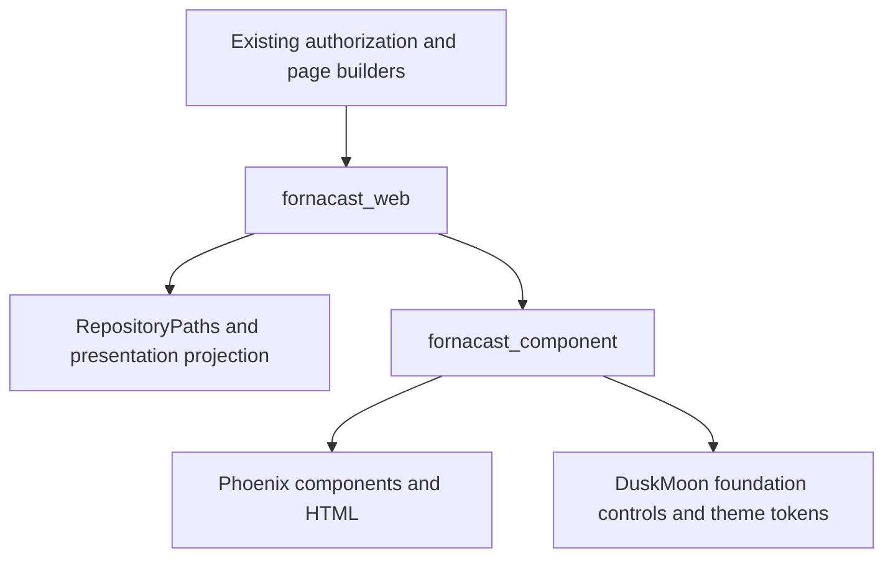

# Fornacast Component App and DuskMoon Git Extraction Design

**Date:** 2026-10-09
**Status:** Approved and implemented locally; browser acceptance passed. Upstream removal Draft PR #182 is open with Storybook validation pending.
**Fornacast baseline:** `ef0055b`, preserving existing uncommitted dependency,
configuration, asset, and owner-link changes.
**DuskMoon inspection:** `duskmoon-dev/phoenix-duskmoon-ui` main at
`f5336d1e8df0f567fa126ecbb985d2ef33f57a1b`; installed Hex version 9.16.7.

## 1. Revised scope and outcome

The user requests an umbrella app at `apps/fornacast_component` to own project
components, migration of all six Git business components out of DuskMoon, and a
subsequent upstream PR removing those components.

This replaces the earlier proposal to leave complex Git viewers in DuskMoon and
put component modules directly in `fornacast_web`. DuskMoon continues to supply
foundation controls and styles; all six Git renderers move into the new app.
The initial usage migration covers shared repository, release, issue, and PR
screens. Existing organization settings, import forms, and the application shell
are not rewritten as part of this Git extraction.

Clicking the owner opens the existing organization/personal namespace. Clicking
the repository name from any repository subpage opens the canonical repository
root, without the current file path, selected ref, or collaboration filter.

## 2. Ownership and dependencies



`fornacast_component` is a presentation library, not a runtime service. It has:

- direct dependencies on Phoenix component/HTML support and `phoenix_duskmoon`
  for foundation components/icons;
- no dependency on `fornacast_web`, Repo, GitCore, or domain umbrella apps;
- no application supervisor, database, endpoint, router, background processes,
  authorization checks, configuration lookups, provider calls, or Git reads;
- declared attrs/slots receiving strings, booleans, numbers, presentation maps,
  lists, and render slots, without references to domain or Web structs.

The Web layer prepares authorized data, permitted actions, destinations, and
presentation states. Rendering cannot trigger new reads or acquire/release Git
leases. Existing request/page builders remain responsible for resource lifetime.

Project component names use the `fc_` prefix. `dm_*` continues to identify DuskMoon
foundation components. Do not introduce wrappers for every primitive, another
UI kit, or `core_components.ex`.

## 3. New app structure

```text
apps/fornacast_component/
  mix.exs
  README.md
  THIRD_PARTY_NOTICES.md
  lib/fornacast_component.ex
  lib/fornacast_component/git_repository.ex
  lib/fornacast_component/repository_layout.ex
  assets/js/clipboard.js
  package.json
  test/test_helper.exs
  test/git_repository_test.exs
  test/repository_layout_test.exs
  test/js/clipboard.test.js
```

The Mix manifest uses the umbrella's shared build/config/deps/lock paths and
current project version. No `Application` module is needed. Component tests run
without SQL sandbox setup or a domain database.

`FornacastComponent` provides a narrow import facade for project components.
Concrete modules use Phoenix and the appropriate DuskMoon primitives directly;
they do not import their own facade. Web consumers can use the facade or explicitly
alias concrete modules. The app must compile without the Web application.

The private npm workspace is named `fornacast-component` and exports its clipboard
ES module. The Web entry imports and initializes that module once. This is an
internal workspace package, not a new published npm/Hex product.

## 4. Migration of all six DuskMoon Git components

Move implementation, attrs/slots, private helpers, and relevant behavior tests
from `PhoenixDuskmoon.Component.DataDisplay.GitRepository` into
`FornacastComponent.GitRepository`.

| Existing export | Project export | Preserved behavior |
| --- | --- | --- |
| `dm_git_repository_header` | `fc_git_repository_header` | Identity, visibility, metadata/action slots, ref, description. Add independent `name_href`. |
| `dm_git_repository_nav` | `fc_git_repository_nav` | Anchor destinations, active state, count badges, navigation slots. |
| `dm_git_file_tree` | `fc_git_file_tree` | Linked rows, file/folder/submodule/symlink icons, metadata, empty state. |
| `dm_git_blob_viewer` | `fc_git_blob_viewer` | Text/raw/copy behavior, binary/non-UTF-8/truncated states. |
| `dm_git_commit_diff` | `fc_git_commit_diff` | Commit metadata, file slots, line numbers/types/content, binary/truncated states. |
| `dm_git_clone_box` | `fc_git_clone_box` | URLs, prepared clone/setup commands, slots, copy feedback. |

Preserve existing attrs/slot contracts wherever possible, including standard href
and supported navigate/patch values. Fornacast continues using server `href`
anchors. Add `name_href` beside `owner_href`; absent link destinations retain
plain-text rendering. The slash separator remains outside both title anchors.

Preserve existing semantic HEEx, DOM hooks/classes, escaping, accessibility,
truncation indicators, exact line breaks, and responsive behavior. Do not rewrite
diff rendering or introduce client-side routing during the extraction.

Retain the MIT copyright and complete permission notice in
`THIRD_PARTY_NOTICES.md`, with upstream repository, source path, version, and
commit provenance. The upstream code is copied into app-owned source, never
patched under `deps/`.

## 5. Shared project layout and Web adapter

`FornacastComponent.RepositoryLayout` owns the existing shared rendering
compositions: frame, ref controls, clone popover, optional panel, breadcrumbs,
and server pagination. Its frame invokes the app-owned Git header/navigation.

Keep typed page projection in the Web app:

- `FornacastWeb.RepositoryPaths`: extract existing URL constructors and full-ref
  selection/normalization; add the owner namespace path. This pure module may
  consume existing Web page structs because it stays in the Web app.
- `FornacastWeb.RepositoryView`: convert the existing typed page result into plain
  presentation data for the shared frame. Prepare identity labels/metadata,
  owner/name hrefs, navigation rows/counts/active flags, ref-form options/values,
  clone URLs/commands, toolbar visibility, and relevant link destinations.

The public frame accepts `view` plus its inner slot. The view contains prepared
header, navigation, toolbar, and clone values; the component does not inspect
`RepositoryPage.Result`, `%GitCore.*`, or account schemas. Standalone renderers
continue accepting their declared attrs/slots. Breadcrumb and pagination callers
supply already-computed items or page URLs rather than asking the app to build
Fornacast routes.

The adapter owns display formatting/ref labels needed for this projection. Keep
page-specific tree/search/diff/language helpers in their existing HTML modules
unless their bodies are directly required by the migration. Avoid a new universal
formatting framework or duplicated URL constructors.

Migrate all 20 repository/release/issue/PR templates to the app-owned frame and
replace every `dm_git_*` invocation with its project equivalent. Remove old shared
rendering functions after their consumers move; do not retain permanent forwarding
components or circular imports. Existing per-page forms and content remain in Web.

## 6. Navigation and integration contracts

| Action | Destination/state |
| --- | --- |
| Click owner `gsmlg-opt` | `/gsmlg-opt`; existing namespace authentication/rendering applies. |
| Click displayed repository name `agent-note` | `/gsmlg-opt/agent-note`, derived from canonical slug, independent of current page/ref/query. |
| Click Code tab | Existing ref-aware Code path. |
| Switch ref, use breadcrumbs/history/raw/search | Existing canonical full-ref and path encoding. |
| Display a name differing from slug casing | Show the display name; navigate using canonical owner/slug values. |

Use normal keyboard-accessible anchors. Keep legitimate zero counts, unknown
counts as absent, exactly one current tab, masked private responses, and all
supported navigation entries. Preserve empty/missing-default states and omitted
ref toolbars on collaboration pages. Remove the #178 title TODO when local name
links are implemented; it is no longer a prerequisite for Fornacast.

Integration files:

- add `{:fornacast_component, in_umbrella: true}` to the Web manifest;
- add the app to root `mix.exs`'s explicit release applications;
- add component `lib` to Tailwind sources and developer watcher paths;
- add the private workspace/clipboard import and update npm lock entries without
  re-resolving unrelated package versions;
- extend formatter inputs for the new app's JavaScript tests/assets if needed;
- document ownership and dependency direction in `AGENTS.md` and app README.

Docker already copies all `apps`; release version updates and Elixir formatter
inputs already use umbrella globs. No database migration, Compose/port change,
new domain API, release publication, or app-shell rewrite is included.

## 7. Clipboard runtime and styling

The current upstream Git components are the only Elixir renderers using
`data-copy-value`. Move their delegated clipboard behavior and its focused tests
into the component app, including secure clipboard API support, insecure-origin
fallback, focus restoration, disabled state, success/error live feedback, timer
reset, and idempotent listener initialization.

Use app-owned `data-fc-copy-value`, `data-fc-copy-label`, and `data-fc-copy-status`
selectors and an app-specific installation marker. This avoids duplicate handling
while Fornacast still imports the currently published DuskMoon runtime for its
other controls. Retain unrelated DuskMoon dialog/hooks/runtime behavior.

Preserve existing Web CSS selectors and data hooks around file trees, blob/diff
viewers, identity, navigation, and clone controls. Add the component source scan
explicitly: after upstream deletion, its compiled CSS cannot be relied on to
supply utility classes used only by the moved app.

## 8. Upstream removal PR

Only prepare the removal PR after the local app, migrated consumers, clipboard,
and focused checks work. Use an isolated checkout/branch within the project's
`.trees` area. Re-check upstream HEAD before making the final diff.

The PR removes the six public Git exports and their implementation, auto-import,
documentation registration, Git component tests, examples, and unused Git runtime.
It must also remove the six Storybook stories/templates/routes/controller actions,
menus/catalog entries, and Git-specific gallery tests. Keep unrelated Storybook
pages and generic UI runtime working. Add a breaking-change/migration note.

Current upstream removal locations include:

- `apps/phoenix_duskmoon/lib/phoenix_duskmoon/component/data_display/git_repository.ex`;
- `apps/phoenix_duskmoon/lib/phoenix_duskmoon/component.ex` and app `mix.exs`;
- `apps/phoenix_duskmoon/test/phoenix_duskmoon/component/data_display/git_repository_test.exs`;
- Git-specific parts of `assets/js/phoenix_duskmoon.js` and its JavaScript tests;
- six `apps/duskmoon_storybook/storybook/data_display/git_*.story.exs` files;
- six Git HEEx demo templates plus router, data-display controller, page catalogue,
  navigation layout, home gallery, and router tests;
- README, home/hooks guides, and changelog documentation.

Deleting public helpers is a breaking library change. Describe that explicitly
in the PR; do not silently publish it as a compatible patch or bump/release
upstream packages. Explain the new Fornacast ownership and identify any residual
consumers. External DuskMoon consumers do not automatically gain access to an
unpublished umbrella app: the migration note must say they need application-owned
composition or explicitly adopted code, not claim a replacement Hex package exists.

Push the scoped upstream branch and open a PR as requested; attach its URL to this
Codex chat. PR creation is the delivery boundary. Do not merge, publish, or change
upstream main without a separate request.

## 9. Scoped verification and sequence

1. Establish the independent Mix/npm app and migrate the six renderers with
   behavior tests and preserved licensing.
2. Move clipboard behavior and verify both clipboard paths, feedback, and
   exactly-once initialization.
3. Build the Web projection/layout usage, migrate all consumers, and implement
   independent owner/repository links.
4. Verify app-only tests without domain storage; focused Web PostgreSQL HTML and
   controller tests via devenv socket with `PGPORT=55432`; asset build, scoped
   formatting, compilation, and release application inclusion.
5. In the browser, verify nested-page title navigation, file/tree/blob/diff
   rendering and copying, empty/setup states, both themes, desktop/mobile widths,
   keyboard focus, and horizontal containment. Restart only the authorized managed
   development app when needed, preserving PostgreSQL and unrelated projects.
6. Prepare and verify the upstream removal against generic library/runtime and
   Storybook checks, then create the upstream PR.

Do not expand to unrelated umbrella tests, fix unrelated failures, or mix existing
uncommitted dependency/asset work into the removal PR. Report scoped failures and
stop the affected slice. No local deletion depends on an upstream release: all
Fornacast consumers must already use the new app before upstream code is removed.

## 10. Delivery status

The user approved this revised design on 2026-10-09. The new app and all 20 frame consumers are implemented and integrated into the main working directory. Dependency maintenance and component migration are separate commit scopes. Focused tests and browser acceptance passed, including canonical title navigation, both clipboard paths, clone popover interaction, themes and responsive containment. Published DuskMoon npm 1.9.0 alignment resolved the consumer loading issue without a dependency-source patch. See the implementation plan for the verified checks.

The upstream removal is open as [Draft PR #182](https://github.com/duskmoon-dev/phoenix-duskmoon-ui/pull/182). Library/runtime checks passed; Storybook verification remains pending due to the local native OXC build's stalled Git fetch. The PR documents the six removed exports as a breaking change and directs consumers to application-owned components without claiming a published replacement package. No merge or publication was performed.
